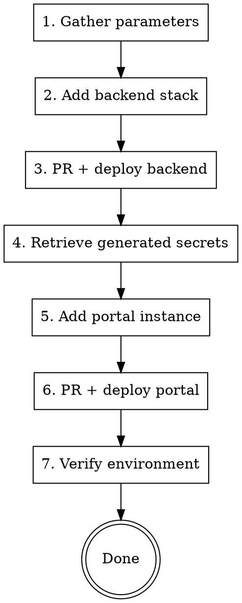

# Create Customer Environment

## Overview

End-to-end provisioning of a new customer environment: backend CDK stack, customer portal instance, deployment, and verification.

**Core principle:** Backend deploys first (creates Cognito + secrets), then portal consumes those secrets. Two repos, two PRs, two deploys, strict ordering.

**Announce at start:** "I'm using the create-environment skill to provision a new `<CUSTOMER>` `<STAGE>` environment."

## The Process



## Parameters to Gather

Ask the user for:

| Parameter | Example | Notes |
|-----------|---------|-------|
| Customer name | `Berkley` | PascalCase. Must exist in `Customer` enum in `customer_registry.py` |
| Stage | `staging` | `dev`, `staging`, or `production` |
| Customer type | `carrier` | `carrier` or `med_review` (aka QME) — match production config |
| enableGSheet | `false` | Enables Google Sheet integration. Check adjacent stacks for precedent |
| enableEmailIngestion | `false` | Enables email ingestion via SES. Most customers: `false` |
| Slack webhook | (see below) | **Production: user MUST provide.** Dev/staging: use shared webhook |

**Verify before starting:** Check that the customer name exists in `packages/customer/customer_registry.py` `Customer` enum. If not, it needs to be added first.

## Stage-Specific Configuration

### AWS Accounts & Regions

| Stage | Account | Region | AWS Profile |
|-------|---------|--------|-------------|
| dev | `804407225882` | `us-east-1` | `dev` |
| staging | `804407225882` | `us-west-2` | `staging` |
| production | `982131176572` | `us-west-2` | `production` |

### Slack Webhooks

| Stage | Webhook | Source |
|-------|---------|--------|
| dev | See `backend/bin/app.ts` — search for the dev stack's `slackWebhookUrl` | Shared dev channel |
| staging | See `backend/bin/app.ts` — search for the staging stack's `slackWebhookUrl` | Shared staging channel |
| production | **Ask the user — each production customer gets a dedicated webhook** | User creates the Slack channel + webhook |

### Backend Deploy Workflows

| Stage | Workflow File |
|-------|--------------|
| dev | `cdk_deploy_dev_manual.yaml` |
| staging | `cdk_deploy_staging.yaml` |
| production | `cdk_deploy_prod.yaml` |

### Portal WAF ACL IDs

| Stage | WAF ACL ARN |
|-------|-------------|
| dev | `arn:aws:wafv2:us-east-1:804407225882:global/webacl/CloudFrontWafAcl-t2A7UFgmIEfO/edc2fec6-fac8-43f8-b210-103041933264` |
| staging | `arn:aws:wafv2:us-east-1:804407225882:global/webacl/CloudFrontWafAcl-W4EfdGcEzHzd/65d53e3b-9b55-4ce4-b72d-f3a14db49feb` |
| production | `arn:aws:wafv2:us-east-1:982131176572:global/webacl/CloudFrontWafAcl-5vllK79uXY0n/42e8adba-4450-4b12-9478-e46cfd30974b` |

**Note:** Some customers have WAF disabled (`cloudFrontWafAclId: ''`). Check existing customers in the same stage for precedent.

### Domain Patterns

| Stage | Pattern |
|-------|---------|
| dev | `<customer>.dev.stream.claims` |
| staging | `<customer>.staging.stream.claims` |
| production | `<customer>.production.stream.claims` |

### Resource Naming

| Resource | Pattern |
|----------|---------|
| Secret name | `CustomerPortalSecrets-<Stage>-<Customer>` (Stage is capitalized: Dev, Staging, Production) |
| Cognito pool | `<Customer>_userpool_<stage>` |
| DynamoDB table | `<customer>-table-<stage>` |
| CDK stack name | `<Customer>Stack` |

## Phase 1: Backend Stack

### File: `bin/app.ts`

Find the correct stage block (`if (stage === "<stage>")`) and add a `create_med_review_stack` call:

```typescript
create_med_review_stack(
    "<Customer>",
    "<SLACK_WEBHOOK>",
    claimsStack, config, env, dataEngineeringStack, adminStack, wafStack,
    awsChatbotStack.alarmTopic, accessLogsBucket, mlStack,
    <enableGSheet>, <enableEmailIngestion>,
    adminStack.ruleSet
);
```

**Placement:** After existing stacks in the stage block. For staging, before the `if (deployDemo)` block.

**Copy the parameter pattern from an adjacent stack in the same stage** to ensure correct argument order.

### Git Operations

```bash
cd <path-to-backend-repo>
git fetch origin master
git checkout -b <your-name>/<customer>-<stage> origin/master
# Edit bin/app.ts
git add bin/app.ts
git commit -m "Add <Customer> <stage> environment"
git push -u origin <your-name>/<customer>-<stage>
gh pr create --title "Add <Customer> <stage> environment" --body "$(cat <<'EOF'
## Summary
- Add <Customer> CDK stack to <stage>

## Test plan
- [ ] CDK deploy succeeds for <Customer>Stack
- [ ] Cognito user pool created
- [ ] Secrets Manager secret populated

Generated with [Claude Code](https://claude.com/claude-code)
EOF
)"
```

### Deploy Backend

**User must trigger this manually** (Claude Code deny rules block deploy workflow triggers):

```bash
cd <path-to-backend-repo>
gh workflow run <WORKFLOW_FILE> \
    --ref <your-name>/<customer>-<stage> \
    -f branch=<your-name>/<customer>-<stage> \
    -f stack_name=<Customer>Stack
```

Watch deployment:
```bash
gh run list --workflow=<WORKFLOW_FILE> --limit 1 --json databaseId -q '.[0].databaseId' | xargs -I{} gh run watch {} --exit-status
```

**Deploy takes ~8-10 minutes.**

## Phase 2: Retrieve Secrets

After backend deploy succeeds, get the secret ARN:

```bash
aws secretsmanager list-secrets \
    --region <REGION> \
    --profile <STAGE> \
    --query "SecretList[?contains(Name, 'CustomerPortalSecrets-<Stage>-<Customer>')].{Name:Name,ARN:ARN}" \
    --output table
```

Save the ARN — needed for portal config.

Also verify Cognito user pool:
```bash
aws cognito-idp list-user-pools \
    --max-results 20 \
    --region <REGION> \
    --profile <STAGE> \
    --query "UserPools[?contains(Name, '<Customer>')].{Id:Id,Name:Name}" \
    --output table
```

## Phase 3: Customer Portal

### File 1: `sst.config.ts`

Find the correct stage block and add a new case:

```typescript
case '<Customer>':
    new CustomerPortalStack(app, `${CUSTOMER_NAME}CustomerPortalStack`, {
        customerDomain: CUSTOMER_NAME.toLowerCase(),
        customerName: CUSTOMER_NAME,
        stage: Stage.<STAGE_ENUM>,    // DEV, STAGING, or PRODUCTION
        customerType: '<carrier|med_review>',
        secretArn: '<SECRET_ARN_FROM_PHASE_2>',
        awsRegion: app.region,
        cloudFrontWafAclId: '<WAF_ACL_ARN>',
        isLocal: false,
    });
    break;
```

**Copy an adjacent case in the same stage block** and modify the customer-specific values.

### File 2: `bin/deploy-stacks.sh`

Add customer name to the correct array:

| Stage | Array |
|-------|-------|
| dev | `CUSTOMER_NAMES_DEV` |
| staging | `CUSTOMER_NAMES_STAGING` |
| production | `CUSTOMER_NAMES_PRODUCTION` |

### Git Operations

```bash
cd <path-to-customer-portal-repo>
git fetch origin master
git checkout -b <your-name>/<customer>-<stage> origin/master
# Edit sst.config.ts and bin/deploy-stacks.sh
git add sst.config.ts bin/deploy-stacks.sh
git commit -m "Add <Customer> <stage> customer portal instance"
git push -u origin <your-name>/<customer>-<stage>
gh pr create --title "Add <Customer> <stage> customer portal" --body "$(cat <<'EOF'
## Summary
- Add <Customer> portal instance to <stage>
- Configure with secret ARN from backend deploy

## Test plan
- [ ] Frontend deploy succeeds
- [ ] DNS resolves to CloudFront
- [ ] Site accessible via Tailscale

Generated with [Claude Code](https://claude.com/claude-code)
EOF
)"
```

### Deploy Portal

**User must trigger this manually:**

```bash
cd <path-to-customer-portal-repo>
gh workflow run deploy.yml \
    --ref <your-name>/<customer>-<stage> \
    -f stage_env=<stage> \
    -f stack_name=<Customer>
```

**Deploy takes ~15-20 minutes.**

## Phase 4: Verification

### DNS
```bash
dig <DOMAIN_FOR_STAGE> +short
# Should return CloudFront IPs
```

### Site Access
Dev/staging environments are WAF-protected — only accessible via Tailscale exit node. A `curl` returning 403 is **expected** without Tailscale.

### Secret Verification
```bash
aws secretsmanager get-secret-value \
    --secret-id "CustomerPortalSecrets-<Stage>-<Customer>" \
    --region <REGION> \
    --profile <STAGE> \
    --query 'SecretString' \
    --output text
```

Confirm all fields populated: `COGNITO_APP_CLIENT_SECRET`, `COGNITO_AUTH_SECRET`, `AUTH_DOMAIN`, `PORTAL_DOMAIN`, `COGNITO_APP_CLIENT_ID`, `COGNITO_USER_POOL_ID`, `API_DOMAIN`, `CASE_CODE_VIEW_API_KEY_ID`.

## Quick Reference

| Step | Repo | File(s) |
|------|------|---------|
| Backend stack | `backend` | `bin/app.ts` |
| Portal instance | `customer-portal` | `sst.config.ts`, `bin/deploy-stacks.sh` |

## Common Mistakes

### Deploying portal before backend
- **Problem:** Secret ARN doesn't exist yet, portal deploy fails
- **Fix:** Always deploy backend first, retrieve secret, then portal

### Wrong indentation in sst.config.ts
- **Problem:** File uses tabs, `sed` can corrupt them
- **Fix:** Use Python heredoc or editor, not `sed`, for inserting blocks

### Forgetting deploy-stacks.sh
- **Problem:** Customer missing from batch deploy array
- **Fix:** Always update both `sst.config.ts` AND `bin/deploy-stacks.sh`

### Expecting site access without Tailscale
- **Problem:** WAF blocks non-Tailscale IPs with 403
- **Fix:** 403 from CloudFront is expected — connect to Tailscale to verify

### Using shared webhook for production
- **Problem:** Production alerts go to wrong channel
- **Fix:** Always ask the user for the dedicated production Slack webhook — never use the shared dev/staging ones
