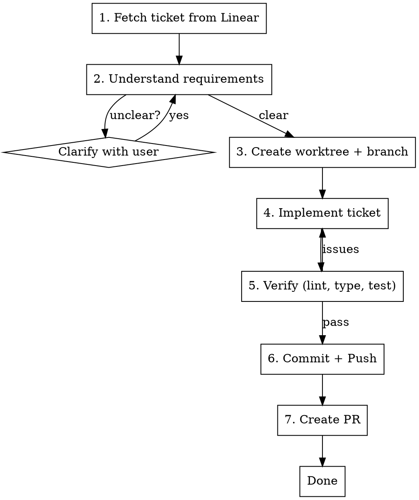

# Implement Ticket

## Overview

End-to-end ticket implementation: fetch Linear ticket, create isolated workspace, implement, ship PR.

**Core principle:** Fetch context first, isolate the work, implement simply, ship cleanly.

**Announce at start:** "I'm using the implement-ticket skill to implement [TICKET-ID]."

## The Process



### Step 1: Fetch Ticket from Linear

Use Linear MCP tools to get ticket details:

```
mcp__linear-server__get_issue with identifier: "<TICKET-ID>"
```

Extract:
- **Title** - What the ticket is about
- **Description** - Full requirements and context
- **Priority** - Urgency level
- **Labels** - Type of work (bug, feature, etc.)
- **Project** - Related project context

### Step 2: Understand Requirements

Read the ticket thoroughly. Identify:
- What needs to be built/changed
- Acceptance criteria (explicit or implied)
- Any technical constraints mentioned
- Related files or areas of the codebase

**If requirements are unclear:** Ask the user ONE question at a time to clarify. Don't proceed with ambiguity.

### Step 3: Create Worktree and Branch

**Update master first:**
```bash
git fetch origin master
```

**Branch naming convention:**
- Use ticket ID in branch name: `<username>/<ticket-id>-short-description`
- Example: `jane/ENG-1234-add-logout-button`
- Keep description to 3-4 words max, lowercase, hyphenated

**Create worktree:**
Follow `superpowers:using-git-worktrees` skill:
1. Check for existing worktree directory (.worktrees or worktrees)
2. Verify it's git-ignored
3. Create worktree with new branch off origin/master:
   ```bash
   git worktree add .worktrees/<branch-name> -b <branch-name> origin/master
   cd .worktrees/<branch-name>
   ```
4. Run project setup (npm install, pip install, etc.)
5. Verify baseline tests pass

### Step 4: Implement the Ticket

**Principles:**
- **Simple and effective** - Minimal code that solves the problem
- **Follow existing patterns** - Match the codebase style
- **No over-engineering** - Don't add features not in the ticket
- **Root cause focus** - If it's a bug, trace and fix the actual cause

**Process:**
1. Explore relevant code areas first
2. Make focused changes
3. Keep commits atomic if implementation has natural stages

### Step 5: Verify

Run all quality checks:

```bash
# Lint (only changed files)
ruff check <changed-files>

# Type check
mypy <changed-files> --ignore-missing-imports

# Tests
pytest <relevant-test-files>
```

**If issues found:** Fix them before proceeding. Don't skip verification.

### Step 6: Commit and Push

**Commit message format:**
```
<ticket-id>: <short description>

<body explaining what changed and why>

Co-Authored-By: Claude Opus 4.5 <noreply@anthropic.com>
```

**Push:**
```bash
git push -u origin <branch-name>
```

### Step 7: Create PR

Use `gh pr create`:

```bash
gh pr create --title "<ticket-id>: <title>" --body "$(cat <<'EOF'
## Summary
<2-3 bullets summarizing changes>

## Linear Ticket
<link to Linear ticket>

## Test Plan
- [ ] <verification steps>

---
Generated with [Claude Code](https://claude.com/claude-code)
EOF
)"
```

**PR title:** Include ticket ID prefix for traceability.

**Report completion:**
```
PR created: <PR-URL>
Branch: <branch-name>
Worktree: <path>

Ready for review.
```

## Quick Reference

| Step | Key Action | Verification |
|------|------------|--------------|
| 1. Fetch | `mcp__linear-server__get_issue` | Ticket exists |
| 2. Understand | Read description | Requirements clear |
| 3. Worktree | `git worktree add` | Tests pass on baseline |
| 4. Implement | Code changes | Changes match ticket |
| 5. Verify | lint + type + test | All pass |
| 6. Commit | `git push -u` | Branch pushed |
| 7. PR | `gh pr create` | PR URL returned |

## Common Mistakes

### Implementing before understanding
- **Problem:** Build wrong thing, waste time
- **Fix:** Fully read ticket, ask clarifying questions first

### Skipping worktree isolation
- **Problem:** Dirty working directory, mixed changes
- **Fix:** Always create fresh worktree off origin/master

### Over-engineering
- **Problem:** Add features not in ticket, bloat PR
- **Fix:** Implement exactly what ticket asks, nothing more

### Skipping verification
- **Problem:** PR fails CI, blocks merge
- **Fix:** Run lint, type check, and tests before pushing

### Vague commit messages
- **Problem:** Hard to trace changes to tickets
- **Fix:** Include ticket ID, explain what and why

## Red Flags

**Stop and ask user if:**
- Ticket requirements are ambiguous
- Implementation requires changes to many unrelated files
- You're unsure if a change matches the ticket intent
- Tests fail and fix isn't obvious

**Never:**
- Implement without reading the full ticket
- Skip creating isolated worktree
- Push without running verification
- Create PR with failing tests
- Add scope beyond what ticket specifies

## Integration

**Uses:**
- `superpowers:using-git-worktrees` - For workspace isolation
- `linear-tickets` skill patterns - For Linear interaction
- `superpowers:finishing-a-development-branch` - For PR creation patterns

**Pairs with:**
- `superpowers:systematic-debugging` - If ticket is a bug
- `superpowers:test-driven-development` - If ticket needs new tests
