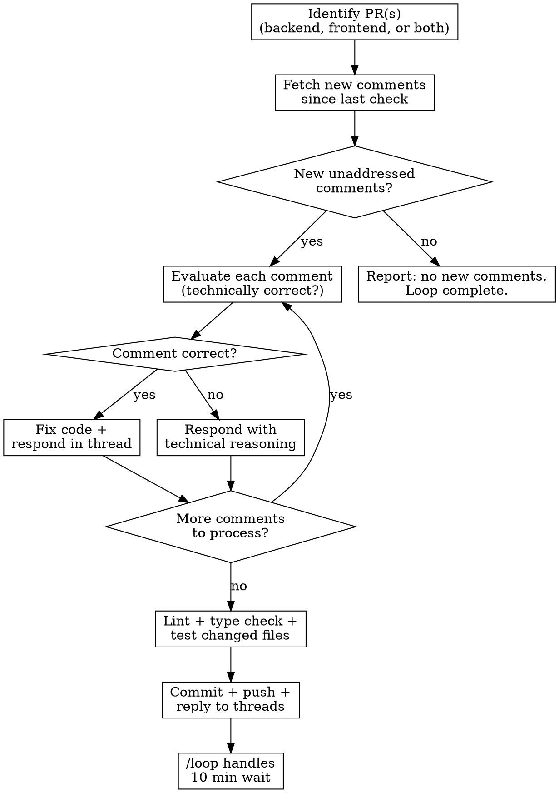

# PR Monitor Loop

## Overview

Autonomous polling loop that monitors a PR for review comments every 10 minutes. When comments arrive, evaluates their technical correctness, fixes valid feedback, pushes, responds to threads, and loops until the PR is clean.

**Core principle:** Fully autonomous after launch. No user interaction needed per iteration.

## When to Use

- After creating a PR that will be reviewed by teammates
- User says "monitor this PR", "watch for comments", "loop on PR feedback"
- User invokes `/pr-monitor-loop`

## The Loop



## Input

Accepts one of:
- **PR number(s):** `#1234` or `1234` -- auto-detects repo from the number
- **PR URL(s):** full GitHub URL
- **"last PR"** or **"my PR"** -- finds most recent PR by the current GitHub user on the repo
- **Repo hint:** "backend", "frontend", "customer-portal", "both"

If "both" or two PRs given, monitor both in each iteration.

## Repo Detection

| Hint | Repo |
|------|------|
| backend | stream-claims/stream-claims-processing |
| frontend, customer-portal | stream-claims/customer-portal |
| both | Both repos |

If no hint, infer from the PR's repo field via `gh pr view`.

## Step-by-Step

### 1. Identify PRs

```bash
# If given a number, get repo info
gh pr view <number> --json headRefName,baseRefName,number,url,repository --repo <owner>/<repo>

# If "my PR" / "last PR", find it (uses the current authenticated GitHub user)
gh pr list --author @me --state open --limit 1 --repo <owner>/<repo> --json number,title,url
```

Record: `owner`, `repo`, `pr_number`, `branch_name`, `worktree_path` for each PR.

### 2. Setup Workspace(s)

For each PR, ensure a worktree exists and is up to date:
```bash
cd <repo-root>
git fetch origin <branch>
# Use existing worktree or create one
git worktree list | grep <branch> || git worktree add .worktrees/<branch> origin/<branch>
cd .worktrees/<branch> && git pull origin <branch>
```

### 3. Start the Loop

Automatically invoke `/loop 10m` to set up the polling interval. The user should NOT need to do this manually -- the skill handles it.

Each iteration executes steps 4-8 below, then `/loop` waits 10 minutes before the next cycle.

Report to user: "Monitoring PR #X -- checking every 10 minutes."

### 4. Fetch New Comments + Check CI Status

```bash
# Inline review comments
gh api repos/<owner>/<repo>/pulls/<number>/comments \
  --jq '[.[] | {id: .id, user: .user.login, body: .body, path: .path, line: .line, created_at: .created_at, in_reply_to_id: .in_reply_to_id}]'

# Top-level issue comments  
gh api repos/<owner>/<repo>/issues/<number>/comments \
  --jq '[.[] | {id: .id, user: .user.login, body: .body, created_at: .created_at}]'

# Check for failed GH Actions on the PR branch
gh pr checks <number> --repo <owner>/<repo>
```

**CI failures count as feedback.** If any check failed (especially tests), diagnose the failure logs (`gh run view <run-id> --log-failed`), fix the root cause in the worktree, and include the fix in step 8's commit. Treat CI failures with the same priority as reviewer comments.

**Filter:**
- Process ALL comments -- human reviewers, Codex, Claude Code, and other AI reviewers
- Ignore only our own replies from THIS loop (posted by the current user AND body contains `Co-Authored-By: Claude Opus`)
- Only process comments newer than last check timestamp
- Ignore comments that are direct replies to our own responses (thread replies we posted)

**Track state:** Keep a set of `addressed_comment_ids` across iterations. Skip any comment ID already in this set.

### 5. Evaluate Each Comment

For each new comment, dispatch a subagent to evaluate:

**Subagent prompt:**
> You are reviewing a code review comment on PR #X in <repo>.
> The comment is on file `<path>` at line `<line>`:
> ```
> <comment body>
> ```
> 
> Read the file at that location in the worktree. Evaluate:
> 1. Is the reviewer's feedback technically correct for this codebase?
> 2. Does the current code actually have the issue they describe?
> 3. Would their suggestion break anything else? (grep for callers/usages)
> 4. Is this a valid concern or a misunderstanding of the code's purpose?
>
> Return:
> - `correct: true/false`
> - `reasoning: <1-2 sentences>`
> - `fix: <what to change, if correct>`
> - `response: <reply to post in thread>`

**Apply `receiving-code-review` principles:**
- No performative agreement ("Great point!", "You're right!")
- Verify against codebase reality before accepting
- Push back with technical reasoning if wrong
- YAGNI check if reviewer suggests adding unused features
- If conflicts with prior architectural decisions, flag it

### 6. Act on Each Comment

**If correct:** Fix the code in the worktree. Record the fix.

**If incorrect:** Draft a technical response explaining why. No defensiveness, just facts.

**If unclear:** Draft a clarifying question. Do NOT guess and implement.

**If architectural:** Flag for user attention -- do not autonomously change architecture.

### 7. Verify

After all fixes for this iteration:
```bash
cd <worktree>

# Backend (Python)
# Run relevant tests, linter

# Frontend (Svelte/TS)  
npx eslint <changed-files>
npx svelte-check --tsconfig ./tsconfig.json --threshold error
npm run test:unit -- --reporter=verbose <relevant-test-files>
```

If verification fails, fix before pushing.

### 8. Commit + Push + Reply

```bash
git add <specific-files>
git commit -m "$(cat <<'EOF'
fix: address PR review feedback

<list what was changed per comment>

Co-Authored-By: Claude Opus 4.6 (1M context) <noreply@anthropic.com>
EOF
)"
git push origin <branch>
```

Reply to each comment thread:
```bash
# For inline review comments
gh api repos/<owner>/<repo>/pulls/<number>/comments/<comment_id>/replies \
  -f body="<response>"

# For top-level comments
gh api repos/<owner>/<repo>/issues/<number>/comments \
  -f body="<response>"
```

Add all processed comment IDs to `addressed_comment_ids`.

### 9. Loop or Exit

The `/loop` infrastructure (set up in step 3) handles the 10-minute wait and re-invocation. Each iteration runs steps 4-8.

- **Exit when:** A full check cycle finds zero new unaddressed comments. Report completion and the loop stops naturally.
- **Report on exit:** "No new comments on PR #X after last check. Monitoring complete."

## State Tracking

Maintain across iterations (in-memory, not persisted):
- `addressed_comment_ids: Set<number>` -- comments already handled
- `last_check_timestamp: string` -- ISO timestamp of last check
- `iteration_count: number` -- how many loops completed
- `fixes_applied: Array<{file, description}>` -- log of all changes made

## Safety Rails

- **Never force-push**
- **Never merge the PR**
- **Never dismiss or resolve review threads** -- reviewer does that
- **Never change architecture autonomously** -- flag for user
- **Always verify before pushing** -- lint + type check + tests
- **Track what you've done** -- maintain fix log for final report
- **Exit cleanly** -- don't loop forever; exit when no new comments

## Reporting

**Each iteration (brief):**
> Iteration #N -- found M new comments. Fixed K, responded to J. Pushed. Next check in 10 min.

**On exit (summary):**
> ## PR Monitor Complete
> 
> **PR:** #X (<url>)
> **Iterations:** N
> **Comments addressed:** M total
> **Fixes applied:**
> - <file>: <description>
> 
> No new comments. Monitoring stopped.

## Error Handling

- **PR merged/closed during loop:** Report and exit gracefully.
- **Push fails (conflict):** Pull, rebase, retry once. If still fails, report and exit.
- **Auth failure:** Create `/tmp/claude/pr-monitor-blocked.txt` and exit loop.
- **Comment on file not in this PR:** Flag as out-of-scope, respond accordingly.
